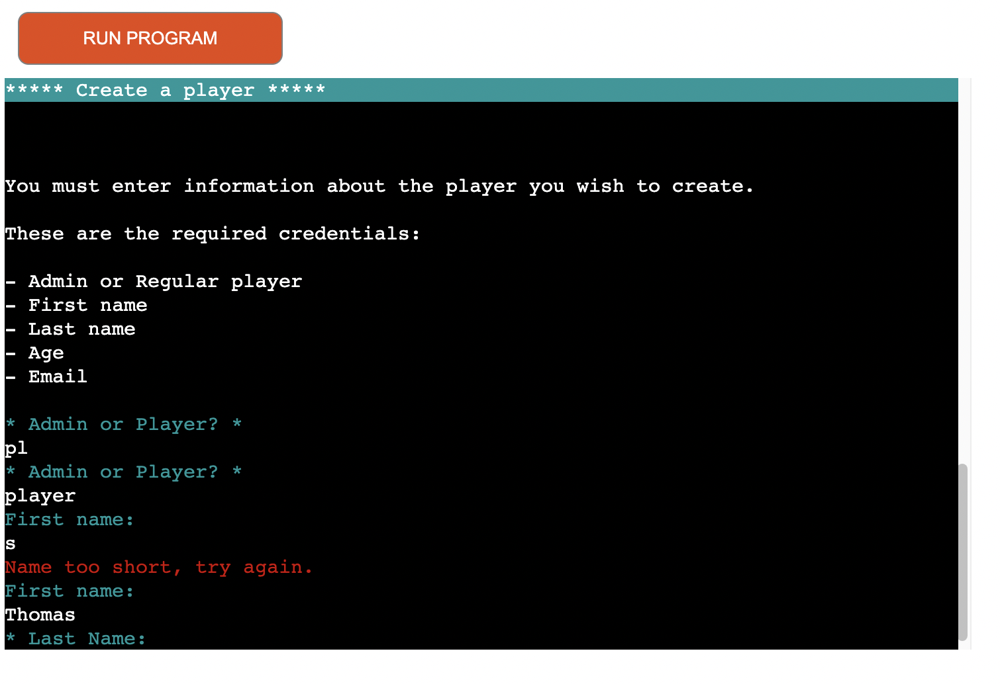
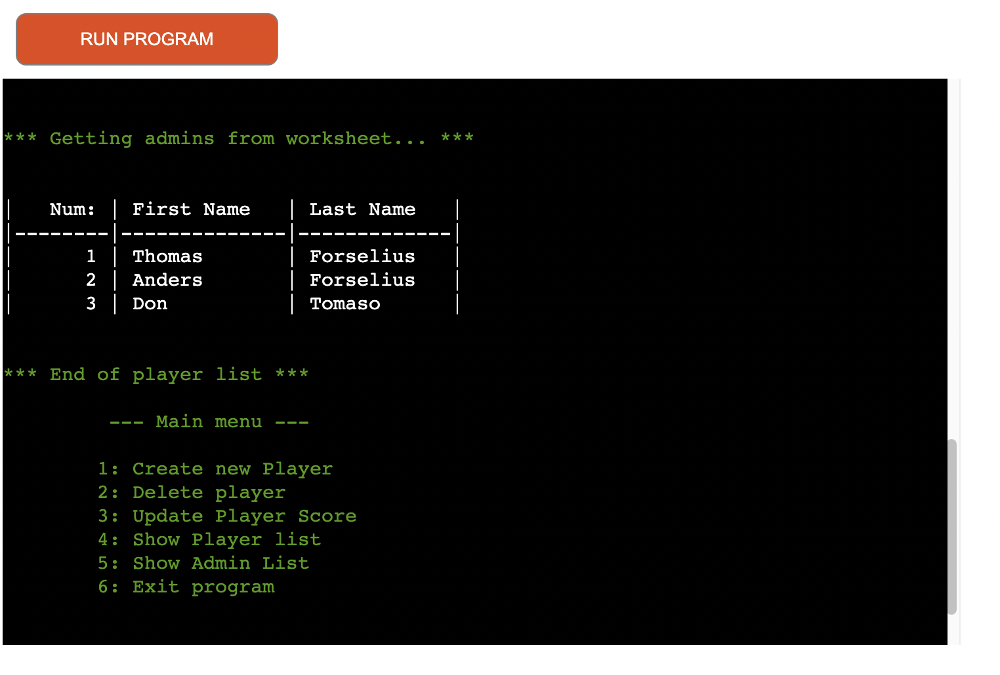
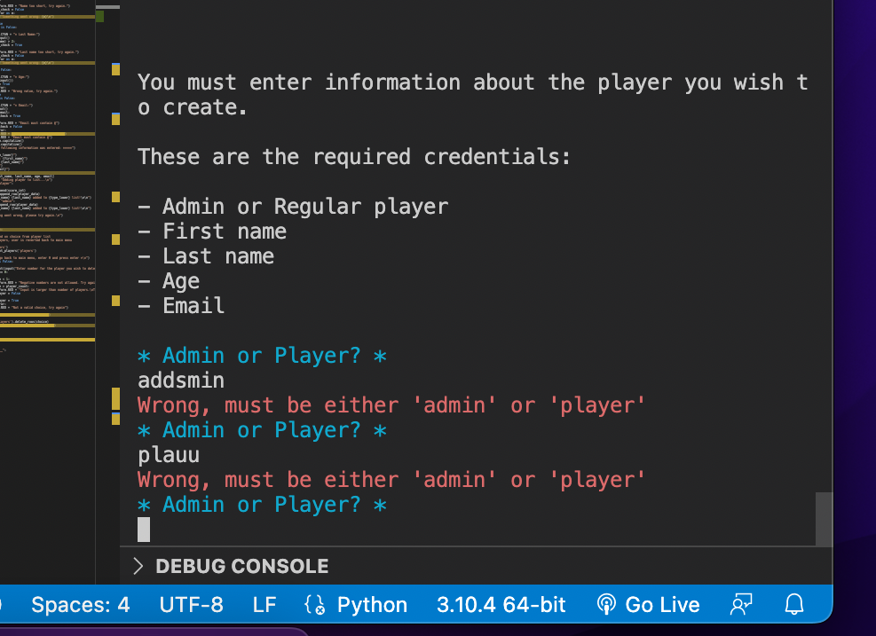
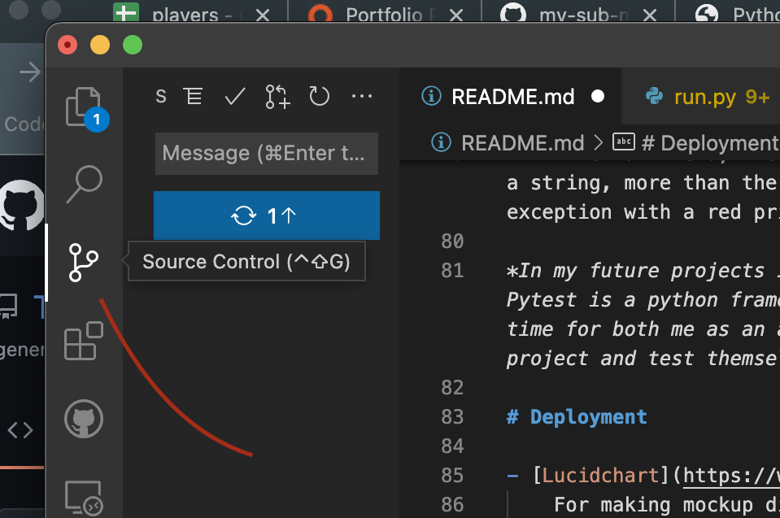
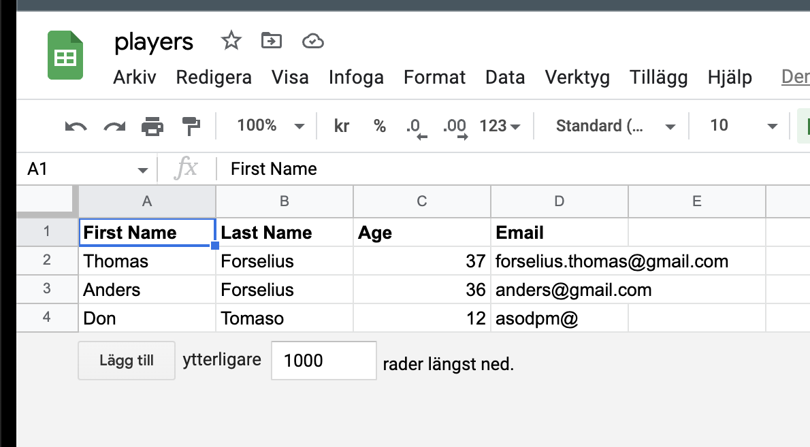

# FriendControl - project documentation

This is the README.md descriptive file of the project FriendControl;
an original web project from Thomas Forselius, studying font-end webdevelopement at CodeInstitute. 

# Table of Contents

> 1. [What is FriendControl?](#what-is-it)
 >- [User story](#user-story) 
> 2. [UX & UI](#ux)
> 3. [Testing](#testing)
> 4. [Tech](#technologies)
> 5. [Deployment](#deployment)
> 6. [Support](#support)

# What is it?

FriendControl is the first version of the backend player management for my upcoming real world game FriendFeud.
It's a simple python script to crud - create, read, update, delete - players and admins for the game. 

The first part of any product or idea is to sketch it down on paper or in a diagram digitally, so I used Lucidchart to help me with the diagram. 
Lucidchart is a free online tool for just this step in the process.

# User Story

To start the game, navigate to this adress: [Heroku Deployment](https://friendfeud-backend.herokuapp.com/)

The application is started automatically when the page loads. 
*To restart the application, click the button "Run Program" at the top*

When starting the game, the user is presented with a menu consisting of 6 menu items:

On each menu item the user is guided through simple steps and is prompted for input when applicable. 

# UX and UI

The program is written to be as clear to read as possible, with line breaks to separate information, colors to group certain objects such as inputs, the main menu and wrong input as well as styling the player and admin lists as tables.

The use of colors is also a part of keeping the application interesting and fun to use, instead of the old, tried and true black/white console. 
Using colorama is a very simple way to spice up an otherwise pale application.

Inputs: Cyan
Main menu: Green
Player tables: white
Wrong input: Red

A key aspect of any user experience is the ease-of-use of a product or application. 
People want quick and easy to use and navigate. Keep the intrest alive!

Another library that I implemented in this application is Tabulate; 
which makes displaying data much more efficient visually. 
There are different styles to choose from, so you can choose which suits your needs most. 

# Testing

The testing procedure in this application is done manually by entering different data in the input prompts.

For every input where the application expects a certain type, length or string I have raised an exception in the code with a print()-statement to let the user know that they have entered incorrect code. 
The make the incorrect input more clear it prints red text explaining what is required for the input to be considered correct.
Once again, the ease-of-use for the user is vital to keep the application easy and interesting

Example of test: 

- Where the application prompts for a number (i.e. menu items or player numbers from a list) I enter letters and/or special characters
    There should be a red print()-statement declaring wrong input, and the user is prompoted again until the correct value is entered
- Where the application prompts for a string value, the only restriction is the length of input which must be longer than 2 letters.
- At the main menu, the user only has 6 alternatives, any input that is a string, more than the num 6 or less than the num 1 triggeres an exception with a red print()-statement

*In my future projects I will be looking to use pytest for testing. Pytest is a python framework for automated testing of code which saves time for both me as an author and anybody whom may want to fork the project and test themselves*

# Technologies

- [Lucidchart](https://www.lucidchart.com)
    For making mockup diagrams 

- [VSCode](https://code.visualstudio.com/)
    The application was built using the IDE VS Code. It's a program for both Windows and MacOS that you run locally but can connect to your github account, built in terminal and live server. It's a perfect tool for writing code locally before pushing to github or uploading to the internet.

> To install libraries in VSCode I use the command 'pip install *library name* ' -  this downloads the library to my computer.
    To be able to use libraries in my deployed project I need to add them to the top of the run.py file like this: 

    example: import gspread
    example: from colorama import Fore, Back, Style, init

>   Also these must be added to the file: *requirements.txt* like this:
    first the library name, followed by == and then the library version

    tabulate==0.8.9
    colorama==0.4.4

- [Google Sheets](http://docs.google.com/spreadsheet)

- [Gspread](https://docs.gspread.org/en/latest/)

Gspread is a library from Google to be able to read/write to google documents

- [Google oauth 2.0](https://developers.google.com/identity/protocols/oauth2)

OAuth 2.0 is used to authenticate towards Google API's

- [Colorama](https://pypi.org/project/colorama/)

Colorama is a library that lets you simply add color to your terminal application

- [Tabulate](https://pypi.org/project/tabulate/)

Lets you style your displayment of data to tables of different styles. 
This a very simple and pwerful way to make the readability of your code better

- [GitHub](https://www.github.com)

An online platform where people upload and contribute code they have written. 

- [Heroku](https://www.heroku.com)

An online platform for deploying backend applications and code

# Deployment

- After making the brainstorming diagram in Lucidchart, I do the following steps:

The first step is to create a Google Sheet file to store all my data in. This is done by this process:

    - Create a spreadsheet file in your Google Docs
    - Now follow this tutorial form CodeInstitute on how to setup your API credentials: 
    [Youtube Tutorial](https://www.youtube.com/watch?v=WTll5p4N7hE) 

1. Go to my github account and create a new repository
2. I clone that repository to my computer via VSCode using the following code in the terminal: 
    gh repo clone ThomasForselius/milestone3
    *note: this requires github extension being installed in VSCode and user logged in to the extension*
3. Now I write all code and add images locally. 
4. When finished with a part of the code, I add, commit and push the changes to github via the source control tab

Since I deploy my python code from GitHub to Heroku, I need to connect them with the following steps: 

1. Register account on Heroku and then login
2. In the upper right hand corner, add a New App
3. Choose App name and region
4. Navigate to Settings tab
5. Under Config Vars, click Reveal Config Vars
6. In the KEY input write CREDS
7. In the VALUE textbox, enter the credentials from your CREDS.json file
8. Under Buildpacks - add first(!) python and then(!) node.js 
9. Navigate to Deploy section and choose GitHub as deployment method
10. Login to your github account, and then choose a repo to deploy to Heroku
11. When you have found your repo, click Connect
12. Now you can deploy your project directly to Heroku from GitHub

# Support