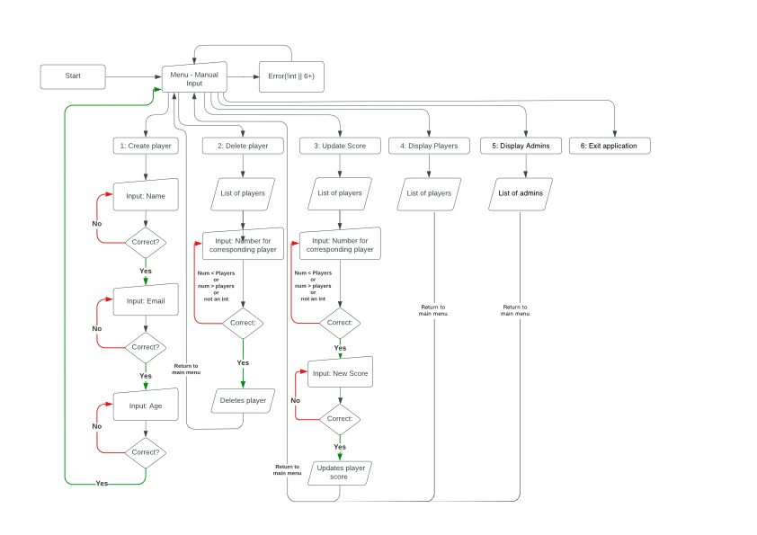
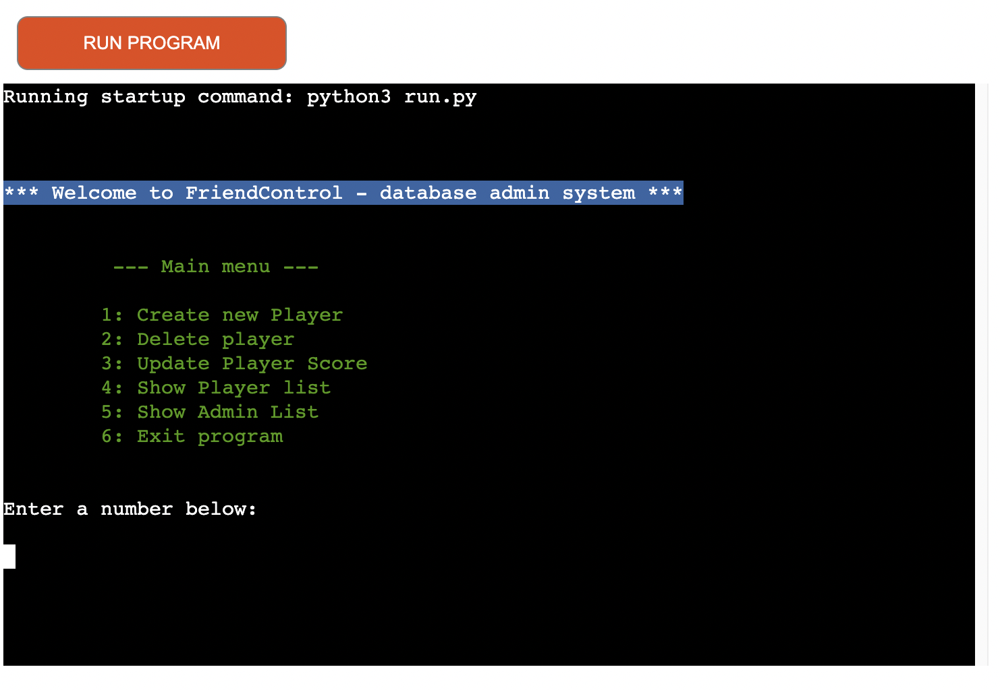

## FriendControl - project documentation

This is the README.md descriptive file of the project FriendControl;
an original web project from Thomas Forselius, studying font-end webdevelopement at CodeInstitute. 

## Table of Contents

> 1. [What is FriendControl?](#what-is-it)
 >- [User story](#user-story) 
> 2. [UI & UX](#ux)
> 3. [Navigation](#navigation)
> 4. [Pages](#pages)

## What is it?

FriendControl is the first version of the backend player management for my upcoming real world game FriendFeud.
It's a simple python script to crud (create, read, update, delete) players and admins for the game. 

# User Story

